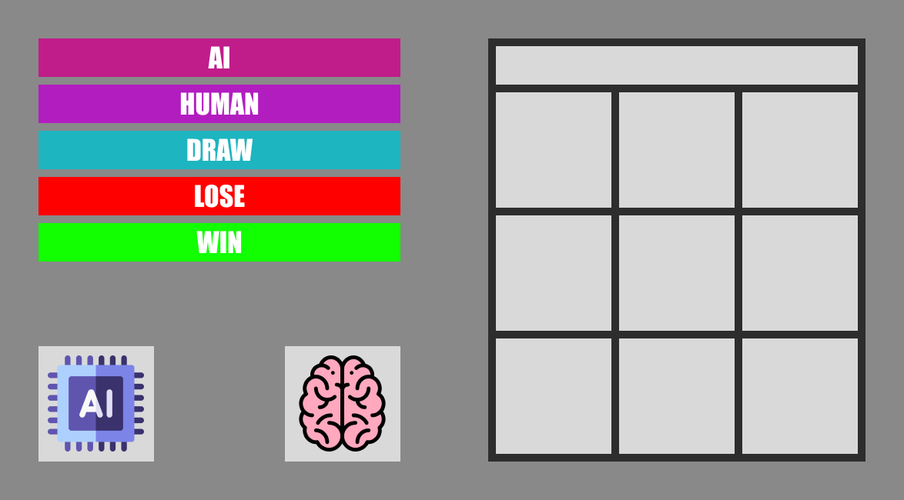

# Tic-Tac-Toe Game with AI

This project is a simple yet challenging Tic-Tac-Toe (XOX) game developed using Python and Pygame. Players can test their skills against an AI opponent powered by the Minimax algorithm with alpha-beta pruning, providing a perfect opportunity to learn about game theory and AI decision-making processes.

### Screenshots


### Demo Video


## Features

- AI optimized with Minimax algorithm and alpha-beta pruning
- Visual interface (using Pygame)
- Automatic game reset

## Requirements

- Python 3.x
- Pygame

## Installation

1. Clone this repository:
   ```
   git clone https://github.com/ahmetalper0/tic-tac-toe.git
   ```
2. Install the required library:
   ```
   pip install pygame
   ```

## How to Play

1. To start the game, run the following command in your terminal or command prompt:
   ```
   python main.py
   ```
2. When the game starts, click on an empty cell to make your move.
3. The AI will automatically make its move.
4. When the game ends, it will automatically restart after 2 seconds.

## Controls

- Mouse click: To make a move
- 'Q' key: To quit the game

## Minimax Algorithm with Alpha-Beta Pruning

The Minimax algorithm with alpha-beta pruning is the foundation of the AI strategy used in this Tic-Tac-Toe game. This algorithm is used to determine optimal moves in two-player turn-based games while efficiently pruning unnecessary branches of the game tree.

### How It Works

1. **Tree Structure**: Game states are represented as a tree structure. Each node represents a game state, and each branch represents a possible move.

2. **Depth-First Search**: The algorithm examines possible moves and outcomes using a depth-first search method.

3. **Evaluation**: A value is assigned to each terminal state (end of game):
   - If AI wins: +1
   - If human player wins: -1
   - In case of a draw: 0

4. **Alpha-Beta Pruning**: This optimization technique reduces the number of nodes evaluated by the minimax algorithm:
   - Alpha: The best (highest) value found so far for the maximizer
   - Beta: The best (lowest) value found so far for the minimizer
   - Prunes branches that cannot possibly influence the final decision

5. **Back-propagation**: Values are propagated from lower levels to upper levels of the tree:
   - Maximizing player (AI) selects the highest value
   - Minimizing player (human) selects the lowest value

6. **Best Move**: The move with the highest value at the root node is selected.

### Advantages

- Optimal strategy: Always selects the best move
- Efficient: Prunes unnecessary branches, significantly reducing computation time
- Predictable: AI's behavior is consistent

### Disadvantages

- Still computationally intensive for very large game trees
- Memory usage: May require high memory for deep trees, though less than standard Minimax

In this project, the Minimax algorithm with alpha-beta pruning ensures that the AI makes the best decision at each move efficiently, providing a challenging and responsive opponent for the player.

## License

This project is licensed under the [MIT License](LICENSE).
